## Diagrama de Clases UML

```mermaid
classDiagram
%% Clases del Modelo (model package)
    class Asistente {
        -String id
        -String nombre
        -String email
        -String telefono
        +Asistente(String nombre, String email, String telefono)
        +Asistente(String id, String nombre, String email, String telefono)
        +getId() String
        +getNombre() String
        +getEmail() String
        +getTelefono() String
        +isValidEmail() boolean
        +isValidTelefono() boolean
        +isValid() boolean
        +toString() String
        +equals(Object obj) boolean
        +hashCode() int
    }

    class Conferencista {
        -String areaDeEspecialidad
        -String biografia
        +Conferencista(String nombre, String email, String telefono, String areaDeEspecialidad, String biografia)
        +Conferencista(String id, String nombre, String email, String telefono, String areaDeEspecialidad, String biografia)
        +getAreaDeEspecialidad() String
        +setAreaDeEspecialidad(String areaDeEspecialidad)
        +getBiografia() String
        +setBiografia(String biografia)
        +toString() String
    }

    class Invitado {
        -List~String~ intereses
        -String comentarios
        +Invitado(String nombre, String email, String telefono, List~String~ intereses, String comentarios)
        +Invitado(String id, String nombre, String email, String telefono, List~String~ intereses, String comentarios)
        +getIntereses() List~String~
        +setIntereses(List~String~ intereses)
        +getComentarios() String
        +setComentarios(String comentarios)
        +toString() String
    }

    class Organizador {
        -String rol
        -List~String~ responsabilidades
        +Organizador(String nombre, String email, String telefono, String rol, List~String~ responsabilidades)
        +Organizador(String id, String nombre, String email, String telefono, String rol, List~String~ responsabilidades)
        +getRol() String
        +setRol(String rol)
        +getResponsabilidades() List~String~
        +setResponsabilidades(List~String~ responsabilidades)
        +toString() String
    }

    class Sponsor {
        -String empresa
        -double montoPatrocinio
        +Sponsor(String nombre, String email, String telefono, String empresa, double montoPatrocinio)
        +Sponsor(String id, String nombre, String email, String telefono, String empresa, double montoPatrocinio)
        +getEmpresa() String
        +setEmpresa(String empresa)
        +getMontoPatrocinio() double
        +setMontoPatrocinio(double montoPatrocinio)
        +toString() String
    }

    class Evento {
        -String id
        -String nombre
        -LocalDateTime fechaHora
        -String ubicacion
        -String descripcion
        -int capacidadMaxima
        -List~Asistente~ asistentes
        +Evento(String nombre, LocalDateTime fechaHora, String ubicacion, String descripcion, int capacidadMaxima)
        +Evento(String id, String nombre, LocalDateTime fechaHora, String ubicacion, String descripcion, int capacidadMaxima)
        +getId() String
        +getNombre() String
        +getFechaHora() LocalDateTime
        +getUbicacion() String
        +getDescripcion() String
        +getCapacidadMaxima() int
        +getAsistentes() List~Asistente~
        +getCantidadAsistentes() int
        +puedeAgregarAsistente() boolean
        +agregarAsistente(Asistente asistente) boolean
        +removerAsistente(String asistenteId) boolean
        +getFechaFormateada() String
        +esFuturo() boolean
        +toString() String
    }

%% Lógica de Negocio (logic package)
    class EventoService {
        -List~Evento~ eventos
        -FileManager fileManager
        +EventoService()
        -cargarDatos() void
        +guardarDatos() void
        +crearEvento(Evento evento) void
        +actualizarEvento(Evento eventoActualizado) void
        +eliminarEvento(String eventoId) void
        +obtenerEventoPorId(String id) Evento
        +obtenerTodosLosEventos() List~Evento~
        +obtenerEventosFuturos() List~Evento~
        +obtenerEventosPasados() List~Evento~
        +registrarAsistente(String eventoId, Asistente asistente) boolean
        +removerAsistente(String eventoId, String asistenteId) boolean
        +existeEvento(String nombre, LocalDateTime fechaHora) boolean
        +getTotalEventos() int
        +getTotalAsistentes() int
        +buscarEventos(String filtro) List~Evento~
    }

%% Utilidades (utils package)
    class FileManager {
        -String EVENTOS_FILE$
        -String ASISTENTES_FILE$
        -String DELIMITER$
        -DateTimeFormatter DATE_FORMATTER$
        +guardarEventos(List~Evento~ eventos) void
        +cargarEventos() List~Evento~
        +guardarAsistentes(Map~String, List~Asistente~~ asistentesPorEvento) void
        +cargarAsistentes() Map~String, List~Asistente~~
        +archivosExisten() boolean
    }

%% Vistas principales (view package)
    class MainFrame {
        -EventoService eventoService
        -JTable tablaEventos
        -DefaultTableModel tableModel
        -JButton btnNuevo, btnEditar, btnEliminar, btnDetalles
        -JButton btnFuturos, btnPasados, btnTodos
        -JLabel lblEstatus
        -CalendarioPanel calendarioPanel
        -JTabbedPane tabbedPane
        +MainFrame()
        -initializeComponents() void
        -setupLayout() void
        -setupEventListeners() void
        -actualizarTabla(String filtro) void
        +actualizarVistas() void
        -nuevoEvento() void
        -editarEvento() void
        -eliminarEvento() void
        -verDetalles() void
    }

    class EventoDialog {
        -JTextField txtNombre, txtUbicacion
        -JTextArea txtDescripcion
        -JTextField txtFecha, txtHora
        -JSpinner spnCapacidad
        -JButton btnGuardar, btnCancelar
        -Evento evento
        -boolean confirmado
        +EventoDialog(Frame parent, Evento evento)
        -initializeComponents() void
        -setupLayout() void
        -setupEventListeners() void
        -cargarDatos() void
        -guardar() void
        -validarCampos() boolean
        -parsearFechaHora() LocalDateTime
        +isConfirmado() boolean
        +getEvento() Evento
    }

    class DetalleEventoDialog {
        -Evento evento
        -EventoService eventoService
        -JLabel lblNombre, lblFecha, lblUbicacion, lblDescripcion, lblCapacidad
        -JTable tablaAsistentes
        -DefaultTableModel tableModel
        -JTextField txtNombreAsistente, txtEmailAsistente, txtTelefonoAsistente
        -JButton btnAgregar, btnQuitar, btnCerrar
        +DetalleEventoDialog(Frame parent, Evento evento, EventoService eventoService)
        -initializeComponents() void
        -setupLayout() void
        -setupEventListeners() void
        -cargarDatos() void
        -actualizarTablaAsistentes() void
        -agregarAsistente() void
        -quitarAsistente() void
    }

%% Calendario (view.calendario package)
    class CalendarioPanel {
        -CalendarioTableModel calendarioModel
        -JTable tablaCalendario
        -JLabel lblTituloMes
        -JButton btnAnterior, btnSiguiente, btnHoy
        -EventoService eventoService
        -MainFrame parentFrame
        +CalendarioPanel(EventoService eventoService, MainFrame parentFrame)
        -initializeComponents() void
        -setupLayout() void
        -setupEventListeners() void
        +refrescarCalendario() void
        -abrirDialogoNuevoEvento(LocalDate fecha) void
        -mostrarEventosDelDia(DiaCalendario dia) void
    }

    class CalendarioTableModel {
        -String[] DIAS_SEMANA$
        -int FILAS$, COLUMNAS$
        -YearMonth mesActual
        -LocalDate primerDiaGrid
        -EventoService eventoService
        -List~Evento~ eventosDelMes
        +CalendarioTableModel(EventoService eventoService)
        +getRowCount() int
        +getColumnCount() int
        +getColumnName(int column) String
        +getValueAt(int rowIndex, int columnIndex) Object
        +setMes(YearMonth nuevoMes) void
        +getMesActual() YearMonth
        +getTituloMes() String
        +getFechaEnPosicion(int row, int column) LocalDate
        -calcularPrimerDia() void
        -cargarEventosDelMes() void
    }

    class CalendarioCellRenderer {
        -Color COLOR_HOY$, COLOR_CON_EVENTOS$, COLOR_OTRO_MES$, COLOR_WEEKEND$, COLOR_NORMAL$
        +getTableCellRendererComponent(...) Component
        -createCellText(DiaCalendario dia) String
        -configurarColores(...) void
        -configurarBorde(DiaCalendario dia) void
        -configurarFont(DiaCalendario dia) void
        -createTooltip(DiaCalendario dia) String
    }

    class DiaCalendario {
        -LocalDate fecha
        -boolean delMesActual
        -List~Evento~ eventos
        +getFecha() LocalDate
        +setFecha(LocalDate fecha)
        +isDelMesActual() boolean
        +setDelMesActual(boolean delMesActual)
        +getEventos() List~Evento~
        +setEventos(List~Evento~ eventos)
        +getCantidadEventos() int
        +tieneEventos() boolean
        +toString() String
    }

    class Main {
        +main(String[] args)$ void
    }

%% Relaciones de Herencia
    Asistente <|-- Conferencista
    Asistente <|-- Invitado
    Asistente <|-- Organizador
    Asistente <|-- Sponsor

%% Relaciones de Composición y Agregación
    Evento "1" *-- "0..*" Asistente : contains
    EventoService "1" *-- "0..*" Evento : manages
    EventoService "1" -- "1" FileManager : uses

%% Relaciones de Dependencia en las Vistas
    MainFrame "1" -- "1" EventoService : uses
    MainFrame "1" -- "1" CalendarioPanel : contains
    MainFrame "1" ..> EventoDialog : creates
    MainFrame "1" ..> DetalleEventoDialog : creates

    DetalleEventoDialog "1" -- "1" EventoService : uses
    DetalleEventoDialog "1" -- "1" Evento : displays

    CalendarioPanel "1" -- "1" CalendarioTableModel : uses
    CalendarioPanel "1" -- "1" EventoService : uses
    CalendarioPanel "1" -- "1" MainFrame : parent

    CalendarioTableModel "1" -- "1" EventoService : uses
    CalendarioTableModel "1" *-- "0..*" DiaCalendario : creates

%% Main class relationship
    Main ..> MainFrame : creates
```

## Descripción de Packages y Responsabilidades

### **Package MODEL** 
- **Evento**: Entidad principal del dominio
- **Asistente**: Clase base para participantes (con herencia múltiple)
- **Conferencista**: Especialización de Asistente con área de especialidad
- **Invitado**: Especialización de Asistente con intereses
- **Sponsor**: Especialización de Asistente con información de patrocinio
- **Organizador**: Especialización de Asistente con roles y responsabilidades

### **Package LOGIC**
- **EventoService**: Servicio principal que maneja toda la lógica de negocio

### **Package UTILS**
- **FileManager**: Persistencia en archivos de texto

### **Package VIEW**
- **MainFrame**: Ventana principal con tabs
- **EventoDialog**: Crear/editar eventos
- **DetalleEventoDialog**: Gestión de asistentes
- **CalendarioPanel**: Vista de calendario
- **CalendarioTableModel**: Modelo de datos del calendario
- **CalendarioCellRenderer**: Renderizado personalizado

### **MAIN** 
- **Main**: Punto de entrada de la aplicación
